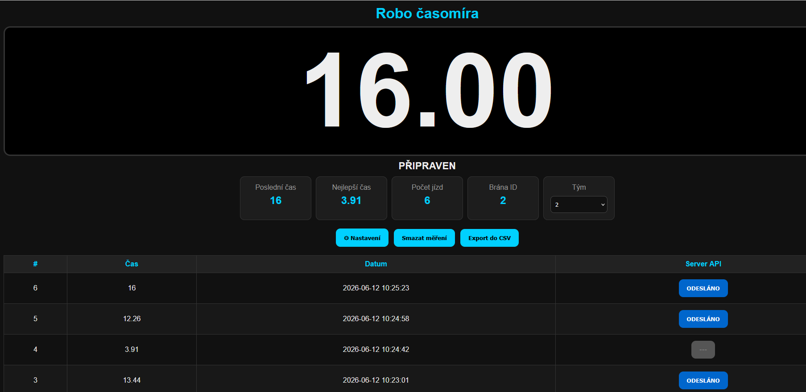
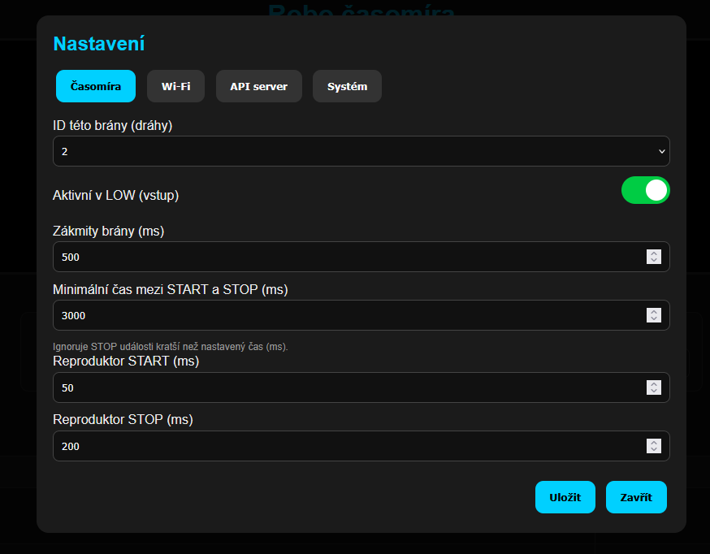
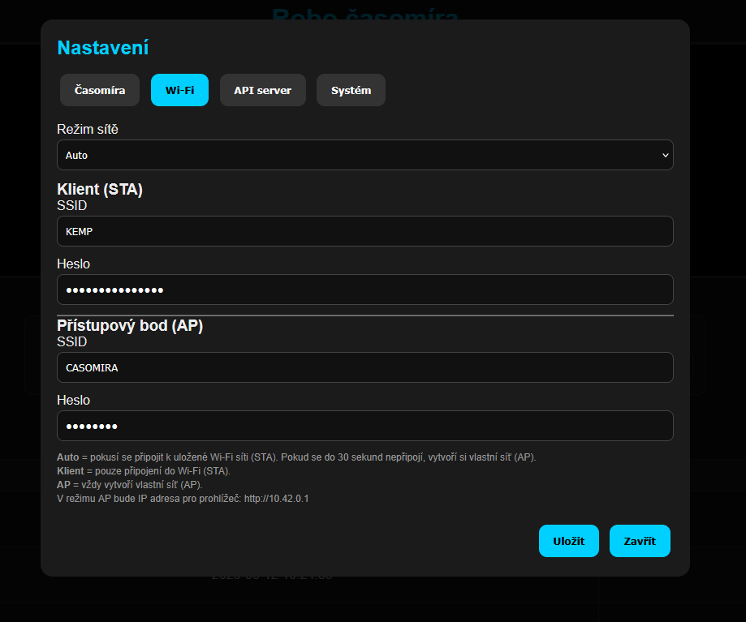
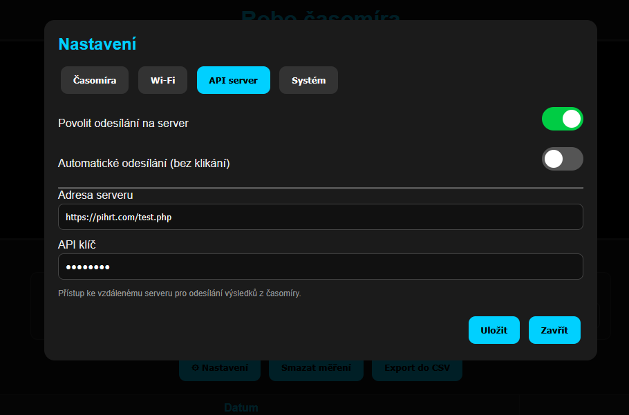
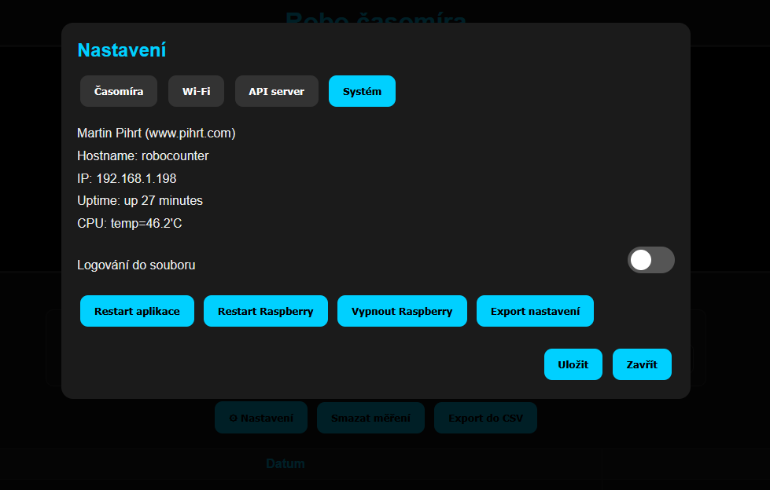
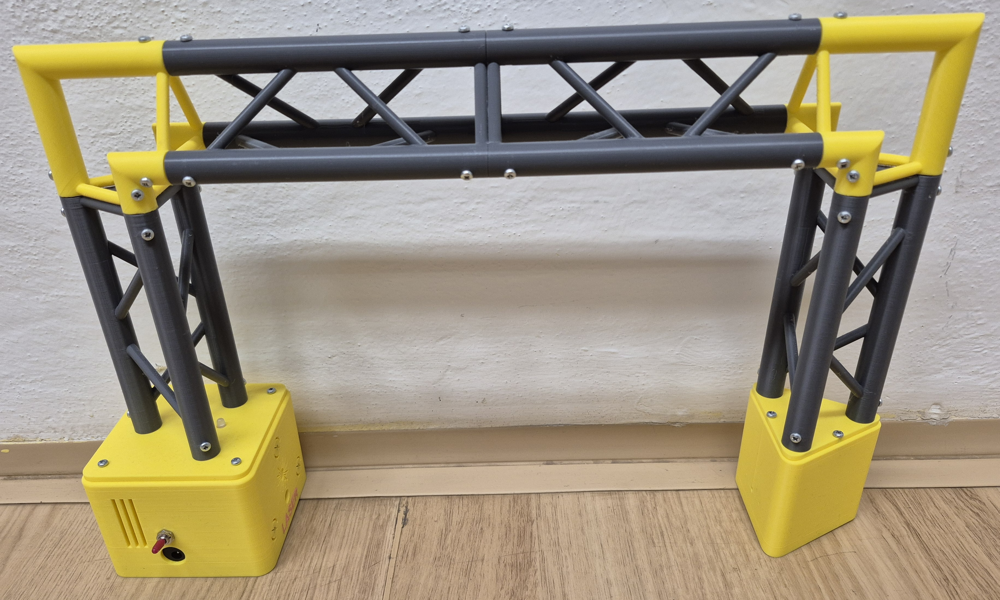
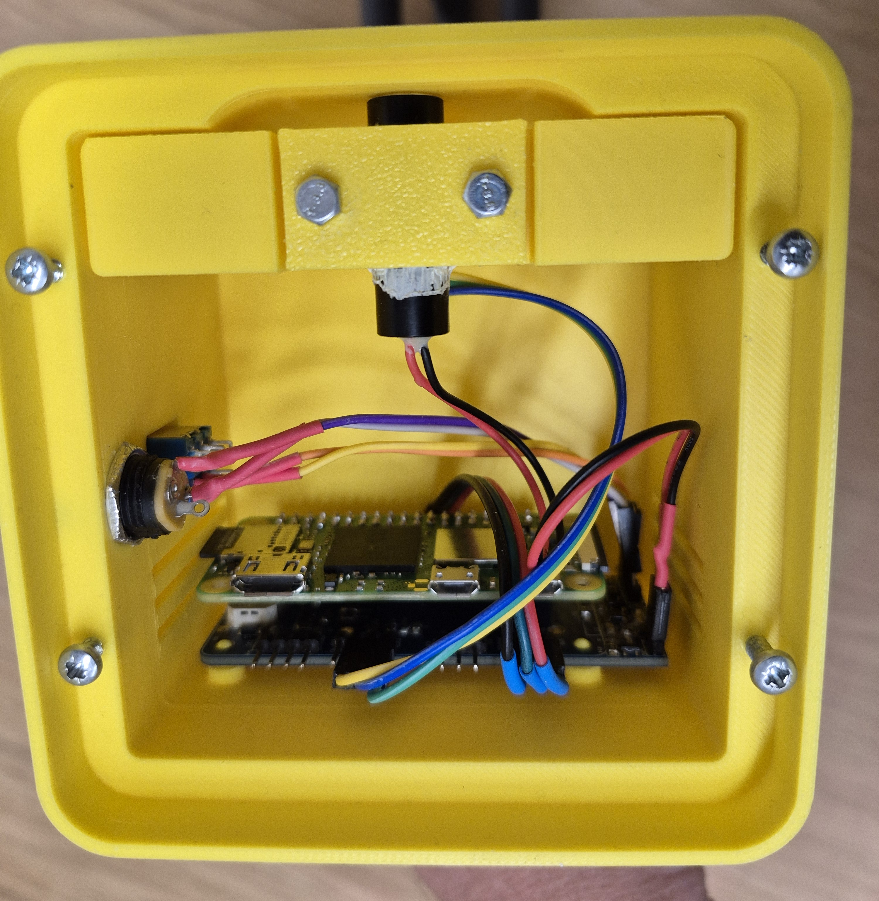
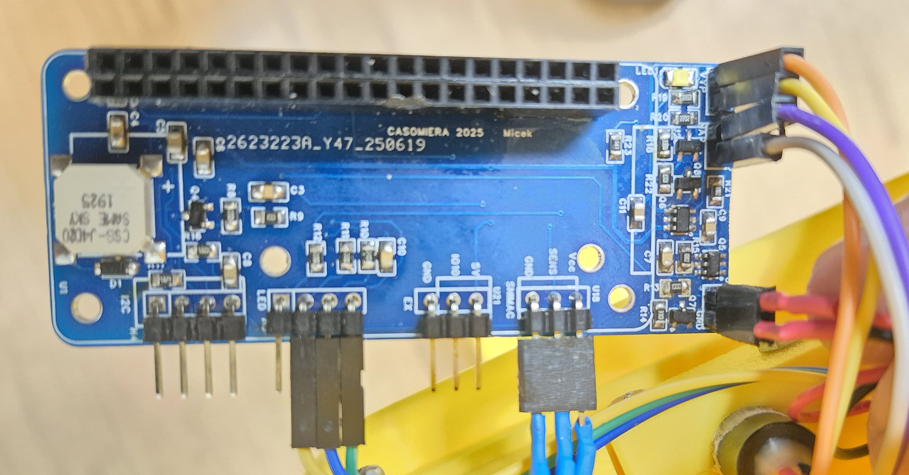

# CASOMIRA Laser Gate

Laser timing gate for the ROBO competition.

https://robovehicle.cz/

The system consists of a Raspberry Pi, a laser gate sensor, a buzzer, status LEDs, and a web interface accessible from any device connected to the local network.

Many thanks to Ing. Michal Lekýr, PhD. for the complete mechanical design and PCB layout.

---

# Features

* Laser gate lap timing
* Live timer display during measurement
* Best lap time tracking
* Last lap time display
* Up to 5000 stored runs
* Last 50 results displayed in web interface
* Newest results shown first
* Configurable debounce filtering
* Configurable Active LOW / Active HIGH sensor mode
* Configurable buzzer timing
* CSV export
* Configuration export
* History reset
* Automatic Wi-Fi management (STA/AP)
* Remote API result upload
* Raspberry Pi system control from web interface
* File logging with enable/disable option

---

# Screenshots

## Web Interface

| Home                  | Fullscreen                  |
| --------------------- | --------------------------- |
|  |  |

| Timer Settings                  | Wi-Fi Settings                 |
| ------------------------------- | ------------------------------ |
|  |  |

| API Settings                  | System Settings                  |
| ----------------------------- | -------------------------------- |
|  |  |

---

## Hardware

| Front View                      | Internal Electronics             |
| ------------------------------- | -------------------------------- |
|  |  |

| PCB                  |
| -------------------- |
|  |


# Installation

```bash
sudo bash install.sh

sudo cp casomira.service \
/etc/systemd/system/

sudo systemctl daemon-reload

sudo systemctl enable casomira
sudo systemctl start casomira
```

Service management:

```bash
sudo systemctl start casomira
sudo systemctl stop casomira
sudo systemctl restart casomira

sudo systemctl status casomira
```

Default SSH credentials:

```text
User: pi
Password: robocounter
```

---

# Required Software

* Nginx
* Flask
* pigpio
* NetworkManager

---

# System Architecture

```text
Internet / LAN
      │
      ▼
 Nginx :80
      │
      ▼
127.0.0.1:5000
      │
      ▼
    Flask
```

The Flask application provides all API endpoints and the web interface.

Nginx acts as a reverse proxy and exposes the application on port 80.

---

# Wi-Fi Operation

## AUTO Mode

At startup the device attempts to connect to a configured Wi-Fi network.

```text
Power ON
    │
    ▼
STA Mode
(connect to Wi-Fi)
    │
    ▼
30 second timeout
    │
    ▼
Connection failed
    │
    ▼
AP Mode
```

If no Wi-Fi connection is available, the device automatically creates its own wireless network:

```text
SSID: CASOMIRA
Password: 12345678
Address: http://10.42.0.1
```

---

# Measurement Process

```text
Beam interrupted
       │
       ▼
START
       │
       ▼
Timer running
       │
       ▼
Beam interrupted
       │
       ▼
STOP
       │
       ▼
Store result
       │
       ▼
Optional API upload
```

---

# Configuration

Available configuration options:

* Gate ID (1–20)
* Team ID (1–100)
* Active LOW / HIGH sensor mode
* Debounce time
* Minimum lap time
* Start buzzer duration
* Stop buzzer duration
* Wi-Fi mode
* STA SSID and password
* AP SSID and password
* API server URL
* API key
* Manual / automatic API upload
* Log file enable / disable

---

# Data Storage

Maximum stored results:

```text
5000 runs
```

Displayed in web interface:

```text
50 newest results
```

Results are stored in:

```text
data/results.json
```

Configuration is stored in:

```text
data/config.json
```

---

# REST API

## Results

```http
GET /api/results
```

Returns:

* current timer state
* current time
* best time
* last time
* run count
* result history

---

## Configuration

```http
GET /api/config
POST /api/config
```

Read and save application configuration.

---

## Result Management

```http
POST /api/reset
GET  /api/export
```

Reset history and export results as CSV.

---

## System

```http
GET  /api/system

POST /api/reboot
POST /api/shutdown
POST /api/restart_app
```

System information and control.

---

## Wi-Fi

```http
POST /api/wifi/ap
POST /api/wifi/client
```

Switch between AP and STA modes.

---

# API Upload

Results can be uploaded to a remote server.

Uploaded payload example:

```json
{
  "gate_id": 2,
  "team_id": 17,
  "id": 154,
  "time": 123.45,
  "timestamp": "2026-06-11 10:15:00"
}
```

Supported modes:

* Manual upload
* Automatic upload after each run

---

# Hardware

* Raspberry Pi
* Laser transmitter
* Laser receiver
* Buzzer
* Status LEDs
* Custom PCB
* 3D printed enclosure

---

# License

Project developed for the ROBO competition timing system.
